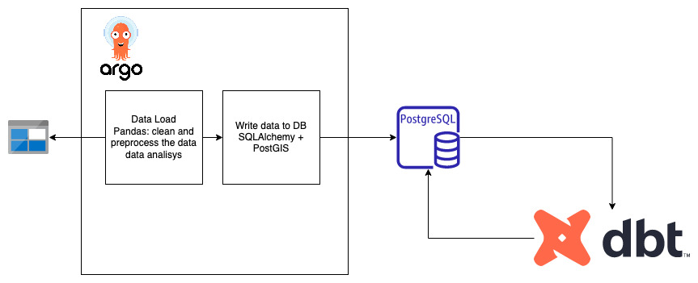

# ERGW1000 Data Processing Pipeline

## Overview

This project is designed to efficiently process and transform ERGW1000 groundwater data. The solution encompasses a Python module for data interaction, a containerized approach for easy deployment, orchestration using Argo Workflows in Kubernetes, and database management and transformation using PostgreSQL with PostGIS and dbt.

## Components

### 1. `ergetl` Python Module
- **Purpose**: The `ergetl` module is responsible for reading data from Azure DataLake and writing the results into a PostgreSQL PostGIS database.
- **Docker Support**: The module includes a Dockerfile with instructions on how to build and push the docker container for easy and consistent deployment.

### 2. Argo Workflow Job Template
- **Implementation**: An Argo Workflow job template has been created to automate and manage the data processing tasks in a Kubernetes cluster.
- **Instructions**: Detailed steps are provided for installing and submitting the Argo workflow job, ensuring a smooth operation within Kubernetes.

### 3. SQL Schema 
- **SQL Schema**: The SQL schema for the necessary database structures is located in the sql folder.

### 4. `ergw1000_dbt` folder
- **DBT Job**: The folder contains a dbt job setup to create a view in the PostgreSQL database, showcasing the transformed data.
- **Data Testing**: A dbt test is implemented to enforce a 'not null' rule on the erg_id field, ensuring data integrity.

## Architecture Diagram

The architecture diagram will provide a visual representation of how these components interact and work together to form an efficient pipeline for processing and analyzing ERGW1000 data. The diagram should ideally illustrate the flow from data ingestion from Azure DataLake to processing in PostgreSQL/PostGIS, management and orchestration in Kubernetes with Argo Workflows, and the transformation and testing with dbt.

## DataSet

Provided dataset is located in the `data` folder and contains a list of shape files. For testing purposes it should be downloaded to Azure Blob Storage container and SAS token should be generated.
